# Agent Capability Foundry

**Package a business workflow as an executable, inspectable agent capability.** The first pack is `support-resolution`: investigate a ticket, propose an answer, require a human approval before closure, check separate reviewer acceptance, and account for the full cost of accepted work.

This first release is a **synthetic reference**, with no customer records, real reviewers, or deployed agent. It gives capability authors a strict pack contract, deterministic runner, offline verifier, and an artifact-level gate for reports from [MCP Compatibility](https://github.com/AAH20/mcp-compatibility), [mcp-redteam](https://github.com/AAH20/mcp-redteam), and [Verified Effects Runtime](https://github.com/AAH20/verified-effects-runtime). A passing artifact gate creates a **candidate**, never a production authorization.

## Run the pack

Node.js 20+; no third-party runtime dependencies or credentials are needed.

```bash
git clone https://github.com/AAH20/agent-capability-foundry.git
cd agent-capability-foundry
npm run demo
node src/cli.js verify packs/support-resolution/pack.json reports/support-resolution.json
npm test
```

The four declared cases produce one accepted resolution, one wrong answer rejected, one correct answer held because approval is missing, and one closed ticket rejected during independent acceptance. The synthetic fixture receives four closure attempts, but records only two distinct effects. All seven cost categories total **210 invented USD cents**, or **210 cents per accepted resolution** across the four eligible cases. These are arithmetic fixture values, not customer economics or evidence of durable external exactly-once effects.

The runner checks the pack's minimum acceptance rate and maximum cost per accepted resolution. `verify` independently recomputes the report from the pack and detects changed output, but the pack author controls the reference answers: verification proves arithmetic and integrity, **not** real-world correctness.

## What is in a capability pack?

The [versioned example pack](packs/support-resolution/pack.json) declares its required tool names, the approval boundary, acceptance rule, synthetic cases, complete cost categories, and outcome targets. All seven cost categories are mandatory: inference, retrieval, infrastructure, human review, rework, operations, and allocated setup. Costs are nonnegative integer cents to avoid floating-point accounting surprises.

```mermaid
flowchart LR
  Pack[Versioned capability pack] --> Validate[Contract validation]
  Validate --> Runner[Synthetic workflow runner]
  Runner --> Approval[Human approval fixture]
  Approval --> Effect[Synthetic idempotent closure fixture]
  Effect --> Acceptance[Independent acceptance fixture]
  Acceptance --> Metrics[Accepted work and all-in cost]
  Metrics --> Receipt[Digest-bound report]
  Receipt --> Verify[Offline recalculation]
```



The [architecture guide](docs/ARCHITECTURE.md) documents the implemented boundaries and the proposed path to integrated deployments.

## Consume the other projects' reports

The gate reads existing JSON formats without altering those projects. Obtain reports against your **owned staging endpoint**:

```bash
# MCP Compatibility: edit the URL in the example and set STAGING_MCP_TOKEN.
node ../mcp-compatibility/src/cli.js run examples/compatibility-workload.json --json reports/compatibility.json

# mcp-redteam: independent HTTP probes can attempt a real tools/call.
node ../mcp-redteam/dist/src/cli.js scan --json --url https://YOUR-OWNED-STAGING-ENDPOINT.example/mcp --header "Authorization: Bearer $STAGING_MCP_TOKEN" > reports/redteam.json

# Verified Effects Runtime: checks its own runtime, not this deployed pack.
node ../verified-effects-runtime/dist/cli.js --output reports/effects.json > /dev/null

node src/cli.js gate packs/support-resolution/pack.json reports/support-resolution.json \
  --compat reports/compatibility.json \
  --redteam reports/redteam.json \
  --effects reports/effects.json \
  --output reports/candidate-gate.json
```

These commands are examples for local sibling checkouts after those projects are built. The Foundry does not install or invoke them automatically. The gate checks that required tools are listed, declared anonymous-access expectations pass, the five default HTTP red-team scenarios complete without high-severity findings, and all eight effect-runtime conformance scenarios pass. It does **not** bind the three reports cryptographically to the same endpoint or show that the pack's closure used Verified Effects Runtime. `productionEligible` is always `false` in this release.

## Release scope

| Implemented | Required before a customer deployment |
| --- | --- |
| Versioned synthetic pack and deterministic runner | Customer-owned data and a consented pilot |
| Explicit approval and separate acceptance states | Authenticated reviewer identity and approval record |
| Synthetic duplicate-effect convergence | Durable effect runtime wired to the actual provider |
| All-in cost per accepted resolution | Measured invoices, labor allocation, and case-mix review |
| Artifact-level candidate gate | Provenance tying one target, build, policy, and run together |
| Offline report recalculation | Live endpoint adapters and staged rollback |

The public pack format and runner are the open layer. A later commercial service could maintain private customer packs, connectors, deployment operations, and outcome monitoring once a real pilot demonstrates demand. No hosted service is included here.

## Development

```bash
npm run check
npm test
```

CI runs the tests on Node 20, 22, and 24. Apache-2.0 · Ahmed Hassan / A2Z SOC.
