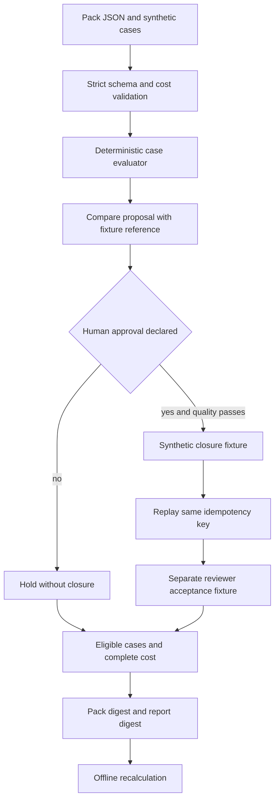
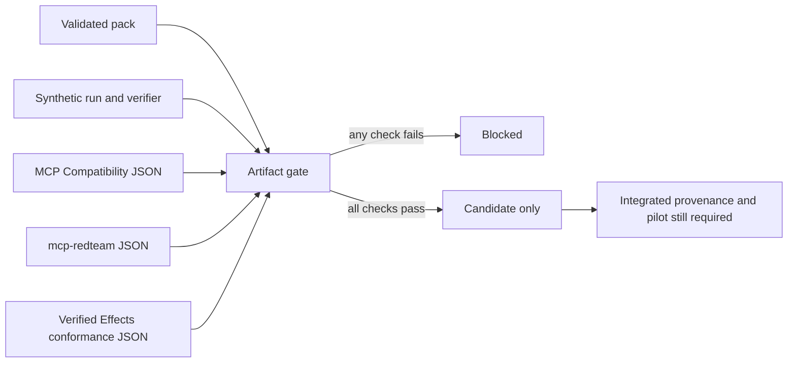
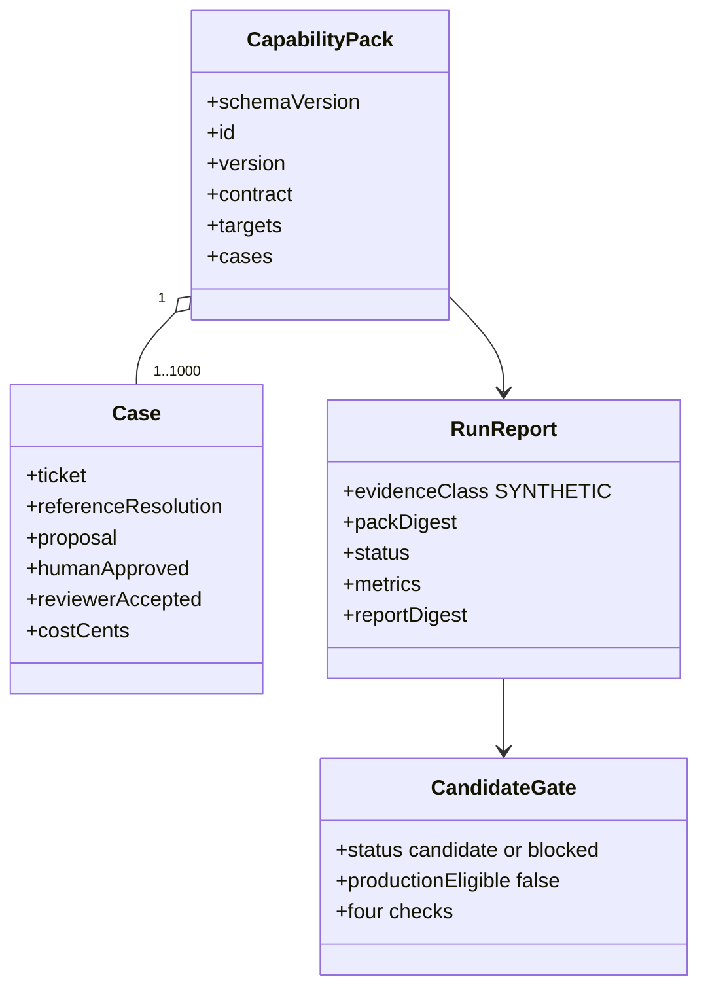
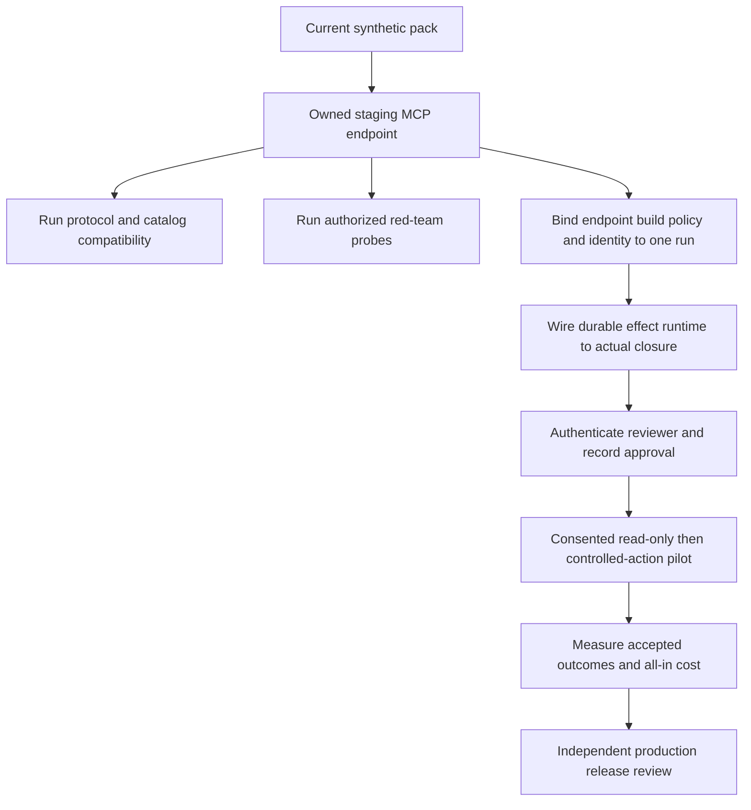

# Architecture and release boundaries

## Implemented pack lifecycle

The in-memory closure fixture is intentionally small. It demonstrates the effect identity contract and duplicate suppression **inside one process**, not crash recovery or exactly-once behavior against a real provider. Verified Effects Runtime owns the durable side-effect design; production integration must call it on the actual closure path rather than treating a separate conformance report as proof.

## Candidate gate across existing repositories

Each input retains its native schema. The gate checks fields rather than guessing from filenames. Because current reports are not bound to one deployed endpoint and effect implementation, there is no path from this gate to `productionEligible=true`.

## Evidence and cost model

`totalCostCents` includes every declared category across **all eligible cases**, including rejected and held cases. `costPerAcceptedCents = totalCostCents / acceptedCases` when the denominator is nonzero; otherwise it is `null` and the pack fails its cost target. No cost-saving or causal claim follows from a synthetic reference fixture.

## Path to a deployable capability

The strongest next engineering increment is a staging adapter that invokes the actual `get_ticket` and `close_ticket` MCP tools against an isolated synthetic backend, with durable effect identity, a separately authenticated approval event, and one retained trace linking every report. That would replace the current artifact-only boundary with a real integrated test. Customer data, secrets, and privileged actions should enter only after that path passes and the customer authorizes a pilot.
