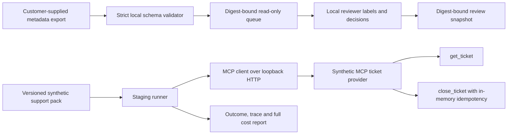

# CapabilityOps: local staging and deployment boundary

CapabilityOps is the Foundry's executable deployment slice for the `support-resolution` pack. It currently has two **separate** local paths: a metadata-only customer export/review queue, and a synthetic MCP staging provider. The review queue is not connected to the provider write path. No customer data or authenticated approval has been used in the staging report.

## Implemented topology



The export accepts only ticket `id`, `status`, and `updatedAt`. Unexpected fields are rejected to avoid silently ingesting private support content. The local review snapshot binds its decisions to the exact queue digest, but reviewer strings are not authenticated. A decision in this snapshot **cannot authorize** any MCP tool call. The staging runner uses the pack's invented approval and acceptance values. Its MCP fixture is local, ephemeral, and synthetic; idempotency ends when the process exits.

```bash
npm ci
node src/ops-cli.js import examples/ticket-export.json --output reports/ticket-queue.json
# Write a local decisions.json containing {"schemaVersion":1,"queueDigest":"<reportDigest from ticket-queue.json>","decisions":[{"ticketId":"T-2001","reviewer":"local.reviewer","decision":"approve"}]}.
node src/ops-cli.js review reports/ticket-queue.json decisions.json --output reports/ticket-review.json
npm run ops:demo
```

The staging report records each read, fixture quality check, fixture approval, effect replay, and acceptance state. Its `syntheticProviderWrites` counts distinct provider mutations. The fixture uses an authorization header, but its token is a constant local test value. It must never be used as a deployed credential.

## Production reference architecture and release gates

```mermaid
flowchart LR
  Source[Customer-owned support API or export] --> Connector[Least-privilege connector]
  Connector --> Normalize[PII minimization and schema mapping]
  Normalize --> Queue[Durable tenant-isolated work queue]
  Queue --> Agent[Capability pack runtime]
  Agent --> Proposal[Proposed resolution]
  Proposal --> Reviewer[Authenticated human review]
  Reviewer --> Policy[Policy and permission gate]
  Policy --> Effects[Durable effect ledger]
  Effects --> Provider[Customer-owned MCP or API endpoint]
  Provider --> Readback[Provider readback and reconciliation]
  Readback --> Acceptance[Independent acceptance and rework]
  Acceptance --> Economics[Measured all-in outcome economics]
  Economics --> Monitoring[Drift and rollback controls]
```



That second diagram is **planned**, not implemented. The release gates are: customer permission and retention terms; connector allowlist and credential rotation; authenticated reviewer identity; durable idempotency and reconciliation against the same target endpoint; per-tenant isolation; measured human labor and provider costs; readback after writes; acceptance by someone other than the proposing agent; incident rollback; and an end-to-end pilot with representative case mix. Existing MCP Compatibility, mcp-redteam, and Verified Effects Runtime reports can supply candidate evidence, but the current artifact gate does not prove these reports came from the same deployed build or endpoint.

## Success measures

For a consented pilot, report eligible cases, accepted resolutions, rework rate, unauthorized write count, duplicate effect count, cost per accepted resolution, and confidence intervals by case segment. Compare against a locked human baseline and record all exclusions. A low cost per accepted resolution in this synthetic example is only a fixture arithmetic check and cannot support a customer ROI claim.
