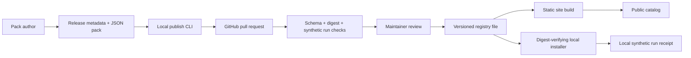

# Agent Capability Network

The Network is a reviewed, static catalog of **declarative synthetic capability packs**. It adds versioned publication, digest-pinned installation, and local run receipts to [Agent Capability Studio](STUDIO.md). It does not execute third-party code, connect to customer systems, count external installs, or verify a publisher's identity. A GitHub handle in release metadata is self-declared; the pull request author and review history supply the visible contribution trail.



## Publish a pack

Only the existing `support-resolution` and `invoice-routing` declarative drivers are accepted. The catalog will reject executable plugins, arbitrary modules, a failed synthetic run, a digest mismatch, malformed metadata, and replacement of an existing version. Fork a bundled pack or create another pack for one of these driver contracts.

```bash
npm ci
node src/studio-cli.js fork invoice-routing my-invoice-flow --output local/my-invoice-flow.pack.json
# Edit the pack and create a metadata JSON file matching its id and version.
node src/network-cli.js publish local/my-invoice-flow.release.json local/my-invoice-flow.pack.json
npm run check
npm test
node src/network-cli.js verify
node src/network-cli.js build-site
# Open a pull request containing registry/packs/my-invoice-flow/0.1.0.json.
```

See `examples/invoice-release.json` for metadata. Use a distinct version for changes after review; published version paths should remain immutable. Maintainers must check the license, source link, synthetic cases, and PR provenance before merging. The CLI and CI establish format and reproducibility, not real-world quality or publisher ownership.

## Install a release

```bash
node src/network-cli.js list
node src/network-cli.js install invoice-routing@0.1.0 local/invoice.pack.json
node src/studio-cli.js run local/invoice.pack.json
node src/network-cli.js run invoice-routing@0.1.0 local/invoice.receipt.json
```

`install` verifies the checked-in digest, writes only the specified local file, and refuses to overwrite an existing file. `run` recomputes the synthetic demonstration and writes a local receipt. The receipt is not an adoption metric, business outcome, or trusted attestation. No install or run event is sent to the project.

## Current release boundary

The public catalog can distribute and validate the **sample data workflows**. To deliver the broader Network vision, the next gated release needs one consenting customer's real read-only workflow, authenticated identities, safe connector permissions, durable effects where applicable, independent acceptance, and opt-in aggregate product metrics. Until then, no claim of outside installations, repeated usage, or network effects is warranted.
