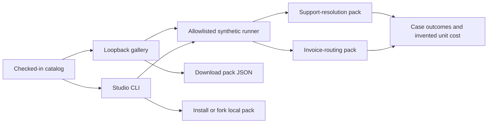

# Agent Capability Studio

Studio is the local, runnable discovery layer for Agent Capability Foundry. Its release is deliberately finite: two synthetic packs in a checked-in catalog, one local demo API, pack downloads, and an install/fork CLI. It does not host third-party code, publish a remote marketplace, connect to a customer's systems, or meter billable work.

The catalog selects a known driver by a fixed `kind` and resolves a fixed pack path. A browser cannot upload code or choose a filesystem path for the server to execute. `POST /api/run` accepts only a catalog ID; the server binds `127.0.0.1`, caps request bodies, and rejects cross-origin POSTs. Pack downloads are data files. The CLI can run an edited local pack through the matching validator, with no external action.

The support pack reuses the Foundry's original deterministic runner. The invoice pack has a separate validator and runner to prove the gallery can host a second workflow type. Its action is an in-memory queue routing effect with replay convergence; it never makes a payment. Both examples carry seven explicit cost categories and distinct human approval versus reviewer acceptance states. Their results are synthetic arithmetic, not customer economics.

For a genuine public ecosystem, the next technical gates are publisher identity and signatures, reproducible build artifacts, sandboxed execution of third-party packs, dependency and permission review, version migration, abuse reporting, and installation telemetry that users knowingly opt into. For a commercial operation, the next product gates are customer-owned connectors, tenant isolation, secret management, authenticated reviewers, durable effects, metered runtime, support commitments, and at least one paid pilot. A public catalog without installed, repeatedly used capabilities would not prove a network effect.
